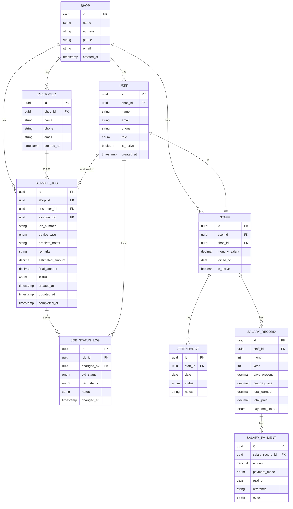

# Entity Relationship Diagram — Rishika Computers Platform

## What is this file?
This file describes the database design — meaning, what data we store
and how different pieces of data are connected to each other.

---

## Enum reference
(These are the fixed options for certain fields)

| Field | Allowed values |
|---|---|
| user.role | OWNER, STAFF, CUSTOMER |
| service_job.device_type | LAPTOP, DESKTOP, PRINTER, MONITOR, UPS, OTHER |
| service_job.status | RECEIVED, DIAGNOSED, IN_PROGRESS, WAITING_FOR_PARTS, COMPLETED, DELIVERED, CANCELLED |
| attendance.status | PRESENT, ABSENT, HALF_DAY |
| salary_record.payment_status | PENDING, PARTIAL, PAID |
| salary_payment.payment_mode | CASH, PHONEPE |

---

## Key design decisions

- Every table has a `shop_id` column — this is what allows the app to
  later support multiple shops (SaaS). Every piece of data belongs to a shop.
- `USER` = anyone who logs into the system.
- `STAFF` = a user who also has salary and attendance records.
- `JOB_STATUS_LOG` = a full history of every status change on a service job.
  Tells us who changed what and when. Full accountability.
- `SALARY_RECORD` = one record per staff member per month.
- `SALARY_PAYMENT` = multiple payment entries against one salary record.
  This handles partial payments (advance + balance).

---

## Diagram
